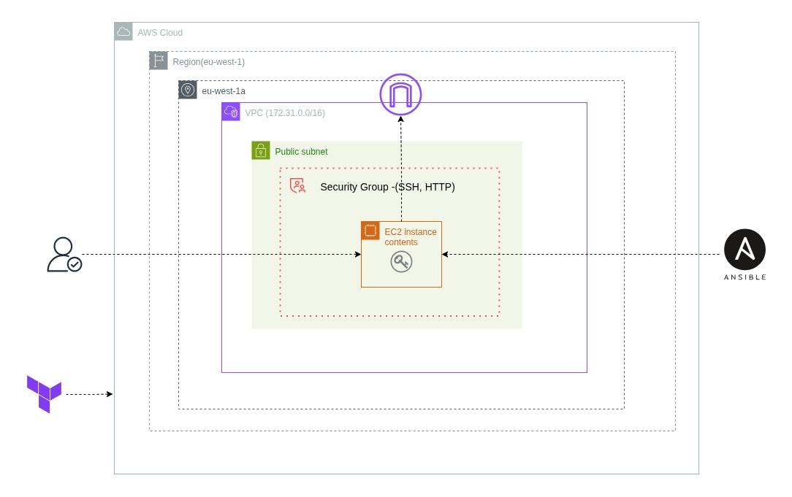

# DevOps Infrastructure Automation with Terraform & Ansible

[](https://terraform.io)
[](https://ansible.com)
[](https://aws.amazon.com)

## Overview

Automated infrastructure provisioning with Terraform and application deployment with Ansible. Deploys a full-stack React/Node.js DevOps Dashboard with S3 remote state, SSH authentication, and production-ready configuration.

## Architecture



**Components:**
- **Remote State**: S3 backend + DynamoDB locking (created by `setup-remote-state.sh`)
- **Infrastructure**: EC2 t3.micro, Security Groups, SSH keys, 30GB encrypted EBS
- **Application**: React frontend + Node.js API + Nginx reverse proxy + PM2 process management

## Prerequisites

- Terraform >= 1.0, Ansible >= 2.9, AWS CLI >= 2.0
- AWS account with programmatic access
- IAM permissions: EC2, S3, DynamoDB
- Linux/macOS/WSL environment

## Quick Start

### Automated Deployment
```bash
git clone <repository-url>
cd Terraform_ansible
chmod +x scripts/*.sh
./scripts/deploy.sh
```

### Manual Deployment
```bash
# 1. Setup remote state
./scripts/setup-remote-state.sh

# 2. Provision infrastructure
cd terraform
terraform apply -auto-approve

# 3. Configure application
../scripts/update-inventory.sh
cd ../ansible
ansible-playbook -i inventory.ini site.yml

# 4. Cleanup
../scripts/cleanup.sh
```

**Verification:**
```bash
curl http://<public_ip>
curl http://<public_ip>/api/health
```

## Evidence Collection

Deployment artifacts in `evidence/` directory:
- `PLAN.txt` - Terraform execution plan
- `APPLY.txt` - Infrastructure provisioning log  
- `HTTP_RESPONSE_CURL.txt` - Application health check
- `Web_output*.png` - Application screenshots
- `DESTROY.txt` - Infrastructure cleanup log

## Technology Stack

**Infrastructure:** Terraform, Ansible, AWS (EC2, S3, DynamoDB)  
**Application:** React 18 + Node.js 18 + Nginx + PM2  
**Security:** SSH keys, encrypted EBS, security groups  

**Flow:** `Internet → Nginx:80 → React SPA | /api/* → Node.js:5000`

## Security

- RSA 4096-bit SSH authentication
- Encrypted EBS volumes and S3 state
- Least-privilege security groups
- Backend services on localhost only
- No hardcoded credentials

## Troubleshooting

| Issue | Solution |
|-------|----------|
| AWS credentials not configured | `aws configure` |
| Terraform state locked | `terraform force-unlock` |
| SSH connection refused | Check security group IP |
| Ansible timeout | `chmod 400` SSH key |

**Debug:** `DEBUG=1 ./scripts/deploy.sh`

## Resources

- [Architecture Diagram](Terraform_ansible_architecture.jpg)
- [Terraform Docs](https://registry.terraform.io/providers/hashicorp/aws/latest/docs)
- [Ansible Docs](https://docs.ansible.com/)

---

**🚀 Deploy:** `./scripts/deploy.sh` | **🧹 Cleanup:** `./scripts/cleanup.sh`
